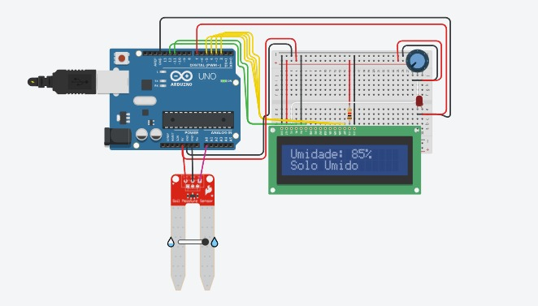

# 🌱 Sistema de Monitoramento de Umidade do Solo

Este projeto utiliza um sensor de umidade do solo conectado a um Arduino Uno para medir a umidade da terra e exibir os dados em um display LCD 16x2. Um LED vermelho é ativado quando a umidade está baixa, indicando que o solo está seco.

---

## 📦 Componentes Utilizados

| Nome   | Quantidade | Componente                        |
|--------|------------|-----------------------------------|
| U1     | 1          | Arduino Uno R3                    |
| U2     | 1          | LCD 16 x 2                        |
| R1     | 1          | Resistor de 1 kΩ                 |
| Rpot1  | 1          | Potenciômetro 250 kΩ (para LCD)  |
| SEN2   | 1          | Sensor de umidade do solo         |
| D1     | 1          | LED Vermelho                      |

---

## 🔌 Esquema de Ligações

### Sensor de Umidade do Solo
- **VCC** → 5V (Arduino)  
- **GND** → GND (Arduino)  
- **A0** → A0 (Arduino)

### LCD 16x2 (modo 4 bits)
- **RS** → Pino 12  
- **E** → Pino 11  
- **D4** → Pino 5  
- **D5** → Pino 4  
- **D6** → Pino 3  
- **D7** → Pino 2  
- **VO** → Potenciômetro (controle de contraste)  
- **RW** → GND  
- **VSS** → GND  
- **VDD** → 5V  
- **Anodo backlight** → 5V com resistor de 1kΩ  
- **Catodo backlight** → GND

### LED Vermelho
- **Anodo** → Pino 7 (Arduino) com resistor  
- **Catodo** → GND

---

## 💡 Funcionamento

- O sensor de umidade realiza uma leitura analógica do solo.
- O valor lido é convertido em porcentagem.
- A umidade é exibida no LCD com duas mensagens possíveis:
  - `Solo Seco`: Umidade < 50% → LED aceso.
  - `Solo Úmido`: Umidade ≥ 50% → LED apagado.
- O valor também é exibido no monitor serial.

---

## 🧠 Código Fonte

```cpp
#include <LiquidCrystal.h>

// Inicializa o LCD com os pinos conectados ao Arduino
LiquidCrystal lcd(12, 11, 5, 4, 3, 2);

int sensor = A0;     // Pino do sensor de umidade
int ledPin = 7;      // Pino do LED

void setup() {
  lcd.begin(16, 2);
  pinMode(ledPin, OUTPUT);
  Serial.begin(9600);
}

void loop() {
  int sensorValue = analogRead(sensor);
  int humidity = map(sensorValue, 0, 1023, 0, 100);

  lcd.clear();
  lcd.setCursor(0, 0);
  lcd.print("Umidade: ");
  lcd.print(humidity);
  lcd.print("%");

  if (humidity < 50) {
    lcd.setCursor(0, 1);
    lcd.print("Solo Seco");
    digitalWrite(ledPin, HIGH);
  } else {
    lcd.setCursor(0, 1);
    lcd.print("Solo Umido");
    digitalWrite(ledPin, LOW);
  }

  Serial.print("Umidade: ");
  Serial.print(humidity);
  Serial.println("%");

  delay(1000);
}
```

---

## 🖼️ Esquema do Circuito



---

## ✅ Conclusão

Este projeto é ideal para automação de irrigação em hortas, jardins ou plantações. Ele permite monitorar a umidade do solo em tempo real, fornecendo um aviso visual (LED) e exibindo os dados de forma clara em um display LCD.

---
